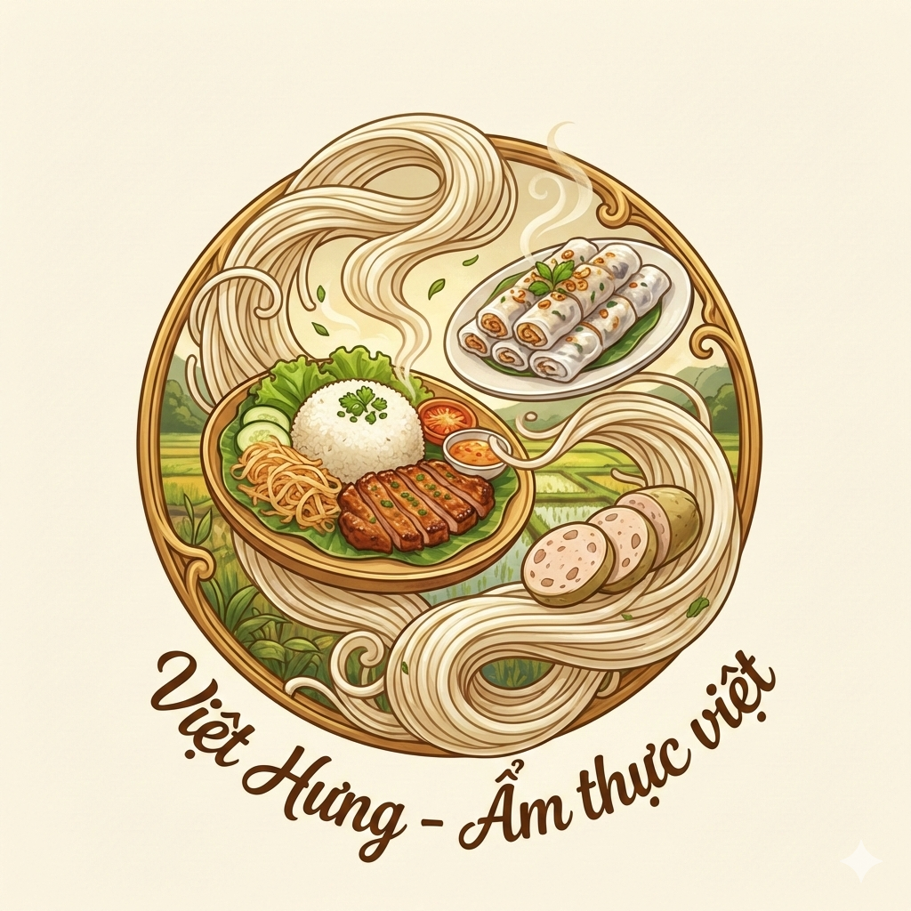

# 🇻🇳 VIỆT HƯNG - TINH HOA ẨM THỰC VIỆT 🇻🇳
https://vietanhnguyenkhac29-tech.github.io/Vietnam-Restaurant/
## 🥢 "Hương Vị Truyền Thống - Trải Nghiệm Hiện Đại" 🥢



---

## � Tầm Nhìn & Sứ Mệnh

**Việt Hưng** không chỉ đơn thuần là một website đặt món, mà là một **"Đại sứ Văn hóa Ẩm thực"** trên không gian số. Chúng tôi ra đời với sứ mệnh cao cả:

- **Gìn giữ:** Bảo tồn những công thức truyền thống, từ bát Phở Hà Nội nồng nàn đến đĩa Cơm Tấm Sài Gòn đậm vị.
- **Quảng bá:** Đưa hình ảnh món ăn Việt vươn tầm chuyên nghiệp, tiếp cận thực khách bằng công nghệ hiện đại.
- **Kết nối:** Xóa tan khoảng cách giữa những tâm hồn yêu ẩm thực và những bữa ăn ngon, sạch, lành.

---

## 💎 Giá Trị Cốt Lõi

| 🌾 Tươi Ngon                                                           | 🏺 Bản Sắc                                     | ⚡ Tiện Lợi                                              | 🎨 Thẩm Mỹ                                                 |
| :--------------------------------------------------------------------- | :--------------------------------------------- | :------------------------------------------------------- | :--------------------------------------------------------- |
| Nguyên liệu được tuyển chọn khắt khe mỗi ngày từ các nguồn địa phương. | Giữ trọn tinh túy hương vị Việt không lai tạp. | Trải nghiệm đặt hàng tối giản, tốc độ xử lý nhanh chóng. | Giao diện hiện đại, sang trọng, khơi gợi cảm hứng ăn uống. |

---

## 🎨 Trải Nghiệm Người Dùng (UX/UI)

Dự án được thiết kế với triết lý **"Aesthetic Minimalism"** kết hợp với hồn cốt Việt:

- **Tone màu chính:** Sự kết hợp giữa sắc đỏ nhiệt huyết (cờ đỏ sao vàng) và những tông màu trầm ấm của gỗ và gốm xưa.
- **Hiệu ứng mượt mà:** Các chuyển động (animations) được tối ưu hóa để tạo cảm giác nhẹ nhàng như cách người Việt thưởng thức ẩm thực.
- **Sắp xếp thông minh:** Menu được bố trí theo dòng chảy trải nghiệm: _Khai vị -> Món chính -> Tráng miệng -> Đồ uống_.

---

## 🚀 Tính Năng Chuyên Nghiệp & Chi Tiết

### 🥣 Thực Đơn Đặc Sắc - "Hành Trình Qua Các Vùng Miền"

Hệ thống phân loại món ăn tinh tế, gợi nhớ về ký ức tuổi thơ:

- **🍜 Phở & Bún:** Những món nước "quốc hồn quốc túy", nước dùng thanh trong, sợi bún mềm dai.
- **🍚 Cơm Việt:** Hạt ngọc trời ban, kết hợp với các món mặn đậm đà, chuẩn vị bữa cơm gia đình.
- **🥖 Bánh Mì:** Đặc sản đường phố vươn tầm thế giới, giòn tan lớp vỏ, đậm đà nhân trọng.
- **🍹 Thức Quà Chiều:** Những món ăn vặt và đồ uống giải khát mang đậm phong cách vỉa hè hiện đại.

### 🛒 Hệ Thống Quản Lý Thông Minh

- **📦 Giỏ hàng động:** Tự động tính toán giá trị, phí giao hàng và các ưu đãi đi kèm.
- **💳 Thanh toán 4.0:** Tích hợp quét mã QR Code, giúp việc giao dịch trở nên an toàn và hiện đại hơn bao giờ hết.
- **🧭 Tìm kiếm chuyên sâu:** Bộ lọc thông minh cho phép tìm kiếm theo tên món, theo nguyên liệu hoặc theo mức giá.

### � Tương Tác Kỹ Thuật Số

- **🔐 Auth System:** Hệ thống đăng ký dành riêng cho thành viên thân thiết để nhận ưu đãi đặc quyền.
- **📢 Thông báo tức thời:** Cập nhật trạng thái chế biến món ăn và các tin tức khuyến mãi nóng hổi qua hệ thống Bell Notification.

---

## � Nền Tảng Công Nghệ (Technical Stack)

Được xây dựng bởi sự tâm huyết của một **Senior IT 10 năm kinh nghiệm**, mã nguồn đảm bảo sự sạch sẽ (Clean Code) và hiệu năng tối ưu:

- **Frontend Architecture:**
  - `HTML5` Semantic cho SEO tốt nhất.
  - `CSS3` với hệ thống biến (Root Variables) giúp tùy chỉnh giao diện linh hoạt.
  - `JavaScript` thuần túy, không phụ thuộc thư viện nặng nề, đảm bảo tốc độ tải trang cực đỉnh.
- **Resources:**
  - Font chữ: **Playfair Display** (cổ điển) & **Quicksand** (hiện đại).
  - Icons: **Font Awesome 6 Pro** cho sự sắc nét.

---

## � Sơ Đồ Tài Nguyên

```
📁 Việt Hưng - ẩm thực việt/
├── 📄 index.html      # Linh hồn của dự án - Thiết kế cấu trúc đa tầng
├── 🎨 style.css       # Bộ thiết kế thẩm mỹ - Chuyên nghiệp & Sang trọng
├── ⚙️ main.js         # Bộ não điều khiển - Logic tương tác cực nhạy
├── 🖼️ assets/         # Tài nguyên hình ảnh độ phân giải cao
└── 📝 README.md       # Tài liệu hướng dẫn & Quảng bá thương hiệu
```

---

## 🤝 Lời Kết

**Việt Hưng** là lời khẳng định rằng: _Ẩm thực truyền thống khi kết hợp với công nghệ hiện đại sẽ tạo nên một sức mạnh lan tỏa vô tận._ Chúng tôi mời bạn bước vào không gian này để cùng cảm nhận hương vị quê hương qua từng dòng code và hình ảnh.

---

## � Thông Tin Liên Hệ & Hỗ Trợ

- 📍 **Địa chỉ:** 123 Đường Ẩm Thực, Quận 1, TP. Hà Nội
- 📧 **Email:** support@viethung.com
- 📞 **Hotline hỗ trợ 24/7:** 1975-004-0030
- 🌐 **Website:** [www.viethung-food.com](<javascript:void(0)>)

---

**© 2025 Việt Hưng. All Rights Reserved.**  
_Made with ❤️ for Vietnamese Food Culture._

